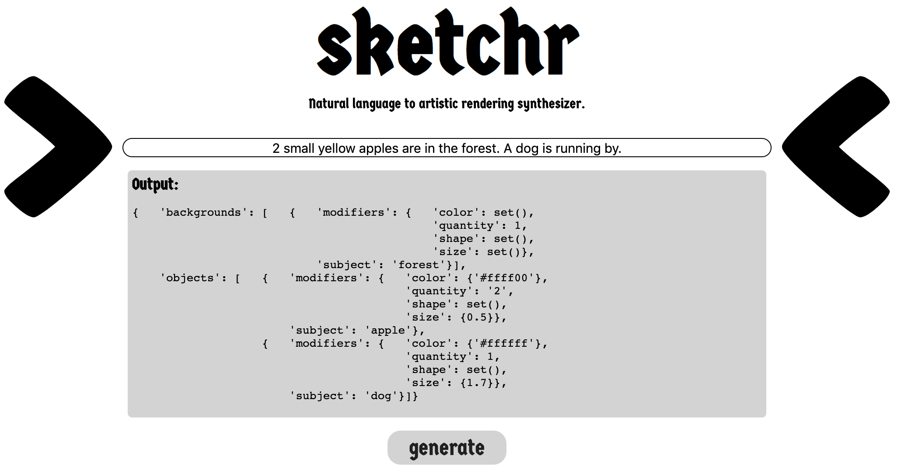
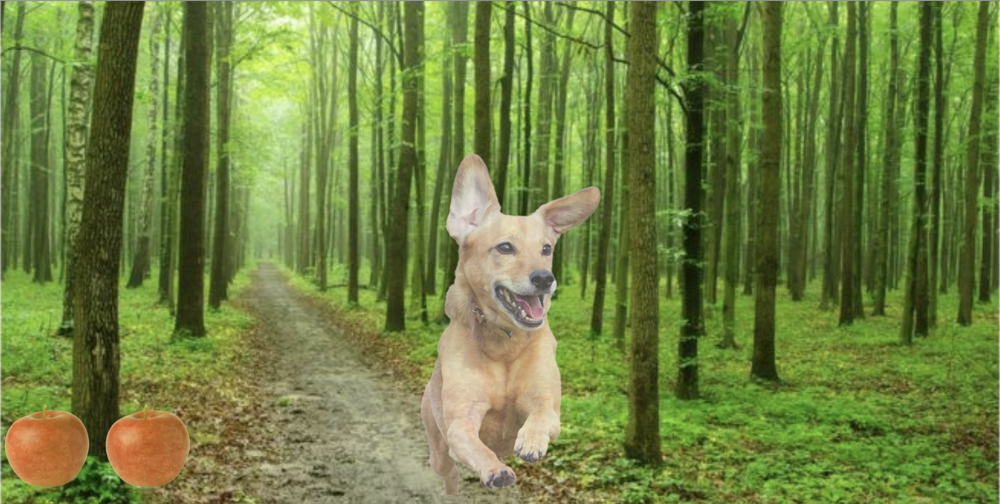

# sketchr
NLP to artistic rendering synthesizer.

## Overview
Sketchr is a natural language processing application running on a Flask web-frontend that takes user inputted sentences, identifies the subjects and associated descriptor words, and synthesizes an image scene.

## How it works
Sketchr works by using the Spacy natural language processing framework for Python. With this framework in hand, the following steps are taken:
1. Text is split into sentences.
2. Noun chunks are extracted from the sentence.
3. If the noun is new, it is added as a subject to the scene. If the noun is described with reference words (the, it, that, etc.) and the same noun already exists in the scene, then it is merged with the last existing noun.
4. The rest of the words in the noun chunk are collected and classified as descriptors
5. Rule based matching is used to check for more subject descriptors
6. A custom trained NER and location model is used to extract a setting from the sentences for the background
7. The inference engine builds, or uses a previously built, statistical n-gram frequency model built using noun chunks from a collection of books to determine more descriptive words to add to the subjects if they aren't descriptive enough.
8. A custom built image retrieval engine is used to pull (only valid, non-broken) images from the imagenet dataset.
9. The composed scene is sent to an HTML and CSS generator that outputs a static file that is rendered at the "/viewer" endpoint.
